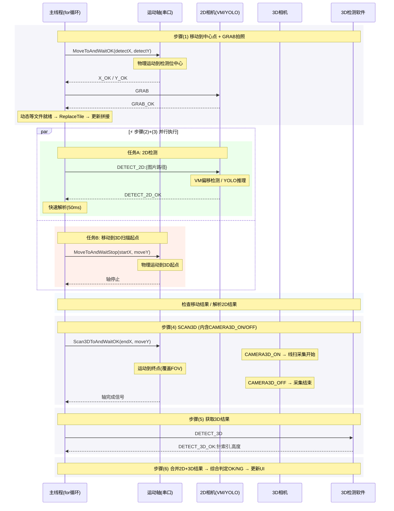

# AOI 检测流程设计文档

## 目录

- [一、检测方式选择](#一检测方式选择)
- [二、YOLO 过渡方案（推荐当前使用）](#二yolo-过渡方案推荐当前使用)
- [三、VM 2D 方案（后续切换）](#三vm-2d-方案后续切换)
- [四、检测流程详解（通用）](#四检测流程详解通用)
- [五、3D 检测 TCP 协议](#五3d-检测-tcp-协议)
- [六、2D+3D 结果合并逻辑](#六2d3d-结果合并逻辑)
- [七、渲染图规范（YOLO 方案）](#七渲染图规范yolo-方案)
- [八、ReplaceTile 原理](#八replacetile-原理)
- [附录：原有 VM 2D 详细说明](#附录原有-vm-2d-详细说明)

---

## 一、检测方式选择

检测流程支持两种 2D 检测方案，通过 `SysParam.DetectionMode` 参数选择（"VM方案"/"YOLO方案"）：

```
StartCheckFlow()
    │
    ├─ DetectionMode == "VM方案" && 2D已连接? ──→ VM 方案
    │                    ├─ GRAB 重新采集图片
    │                    ├─ ReplaceTile 新图替换瓦片
    │                    └─ DETECT_2D TCP 通信
    │
    └─ DetectionMode == "YOLO方案" && YOLO就绪? ──→ YOLO 方案（过渡方案）
                             ├─ 使用已存储图片
                             ├─ Python 子进程 IPC 检测
                             ├─ 生成渲染图
                             └─ ReplaceTile 渲染图替换瓦片
```

---

## 二、YOLO 过渡方案（推荐当前使用）

当 VM 2D 未连接时，自动回退到 YOLOv8 OBB 模型进行 2D 偏移检测。

### 2.1 完整流程（每个检测位）

```
                    ┌─────────────────────────┐
                    │  移动到检测位中心点       │
                    │  (detectX, detectY)      │
                    └─────────┬───────────────┘
                              │
                    ┌─────────▼───────────────────────────┐
                    │  ⚡ 并行执行 (Task.WhenAll)          │
                    │  ┌──────────────┐ ┌──────────────┐ │
                    │  │ YOLO 2D检测  │ │ 移动到3D     │ │
                    │  │ DetectWith  │ │ 扫描起点     │ │
                    │  │ YoloAsync() │ │ MoveToAnd    │ │
                    │  │ Python IPC  │ │ WaitStop()   │ │
                    │  │ 推理→dx/dy  │ │ (startX,     │ │
                    │  │ 生成渲染图   │ │  moveY)      │ │
                    │  └──────┬──────┘ └──────────────┘ │
                    └─────────┬──────────────────────────┘
                              │
                    ┌─────────▼──────────────┐
                    │  解析YOLO结果           │
                    │  + ReplaceTile(渲染图)  │
                    └─────────┬──────────────┘
                              │
                    ┌─────────▼──────────────┐
                    │  SCAN3D                │
                    │  Scan3DToAndWaitOK()   │
                    │  [内含 CAMERA3D_ON →   │
                    │   线扫运动 →           │
                    │   CAMERA3D_OFF]        │
                    └─────────┬──────────────┘
                              │
                    ┌─────────▼──────────────┐
                    │  DETECT_3D TCP         │
                    │  → 获取高度数据         │
                    └─────────┬──────────────┘
                              │
                    ┌─────────▼──────────────┐
                    │  合并 2D+3D 结果        │
                    │  dx/dy ← YOLO          │
                    │  h     ← 3D            │
                    │  OK/NG 判定            │
                    └────────────────────────┘
```

### 2.2 关键决策点

| 问题 | 方案 |
|------|------|
| **检测时是否重新拍照？** | **否**，YOLO 使用全图采集时已存储的图片，不需要 2D 相机参与 |
| **渲染图哪里生成？** | **Python 端**（`yolo_detect_server.py`）检测完成后绘制，保存到检测结果目录 |
| **渲染图如何显示？** | `ReplaceTile` 将渲染图替换到拼图中该检测位的网格位置 |
| **结果如何可视化？** | 渲染图直接显示在拼图窗口 + `PinResults` 列表数据表格 |
| **图像路径如何获取？** | 通过 `_imageManager.GetImagePaths()` + `gridIndices` 映射按 GrabIndex 查找 |
| **IPC 通信方式？** | stdin/stdout JSON Lines（Python 子进程） |

### 2.3 代码入口

| 方法 | 位置 | 说明 |
|------|------|------|
| `InitYoloDetector()` | `MainViewModel.cs:256` | 启动时初始化 Python 子进程 |
| `DetectWithYoloAsync()` | `MainViewModel.cs:293` | YOLO 检测入口（调用 YoloDetector） |
| `YoloDetector.DetectAsync()` | `YoloDetector.cs:97` | JSON Lines IPC 通信 |
| `yolo_detect_server.py` | 项目根目录 | Python 端：加载模型 → 推理 → 匹配 → 渲染 |
| `StartCheckFlow()` | `MainViewModel.cs:1450` | 检测主流程，YOLO 路径在 `else if (_hasYoloDetector)` |
| `ReplaceTile()` | `FullImageManager.cs:127` | 渲染图替换瓦片 |

---

## 三、VM 2D 方案（后续切换）

当 VM 2D 连接正常时，使用 VM 方案。

### 3.1 完整流程（每个检测位）- RECT/VM方案

```
                    ┌─────────────────────────┐
                    │  移动到检测位中心点       │
                    │  (detectX, detectY)      │
                    └─────────┬───────────────┘
                              │
                    ┌─────────▼───────────────┐
                    │  GRAB 重新采集           │
                    │  ← GRAB_OK_序号         │
                    │  动态等待文件就绪        │
                    │  ReplaceTile(新图片)     │
                    └─────────┬───────────────┘
                              │
                    ┌─────────▼───────────────────────────┐
                    │  ⚡ 并行执行 (Task.WhenAll)          │
                    │  ┌──────────────┐ ┌──────────────┐ │
                    │  │ VM 2D检测    │ │ 移动到3D     │ │
                    │  │ DETECT2D_    │ │ 扫描起点     │ │
                    │  │ RECT:{路径}  │ │ MoveToAnd    │ │
                    │  │ TCP检测      │ │ WaitStop()   │ │
                    │  │ 解析偏移结果  │ │ (startX,     │ │
                    │  │ 构建叠加层   │ │  moveY)      │ │
                    │  └──────┬──────┘ └──────────────┘ │
                    └─────────┬──────────────────────────┘
                              │
                    ┌─────────▼──────────────┐
                    │  SCAN3D                │
                    │  Scan3DToAndWaitOK()   │
                    │  [内含 CAMERA3D_ON →   │
                    │   线扫运动 →           │
                    │   CAMERA3D_OFF]        │
                    └─────────┬──────────────┘
                              │
                    ┌─────────▼──────────────┐
                    │  DETECT_3D TCP         │
                    │  → 获取高度数据         │
                    └─────────┬──────────────┘
                              │
                    ┌─────────▼──────────────┐
                    │  合并 2D+3D 结果        │
                    │  dx/dy ← VM            │
                    │  h     ← 3D            │
                    │  OK/NG 判定            │
                    └────────────────────────┘
```

### 3.2 完整流程（每个检测位）- Blob方案

Blob方案在检测流程中增加Z轴调焦和两次GRAB拍照，分别采集焊盘图和针尖图。

```
                    ┌─────────────────────────┐
                    │  移动到检测位中心点       │
                    │  (detectX, detectY)      │
                    └─────────┬───────────────┘
                              │
                    ┌─────────▼───────────────┐
                    │  Z轴调焦至焊盘焦距       │
                    │  FocusParams[0]          │
                    └─────────┬───────────────┘
                              │
                    ┌─────────▼───────────────┐
                    │  第一次GRAB（焊盘图）     │
                    │  SET_PATH:Origin目录     │
                    │  → GRAB → GRAB_OK       │
                    │  → 动态等文件就绪        │
                    │  → ReplaceTile(焊盘图)   │
                    └─────────┬───────────────┘
                              │
                    ┌─────────▼───────────────┐
                    │  Z轴调焦至针尖焦距       │
                    │  FocusParams[3]          │
                    └─────────┬───────────────┘
                              │
                    ┌─────────▼───────────────┐
                    │  第二次GRAB（针尖图）     │
                    │  SET_PATH:Pin目录        │
                    │  → GRAB → GRAB_OK       │
                    │  → 动态等文件就绪        │
                    │  → 保存针尖图片路径      │
                    └─────────┬───────────────┘
                              │
                    ┌─────────▼───────────────────────────┐
                    │  ⚡ 并行执行 (Task.WhenAll)          │
                    │  ┌──────────────┐ ┌──────────────┐ │
                    │  │ Blob 2D检测  │ │ 移动到3D     │ │
                    │  │ DETECT2D_    │ │ 扫描起点     │ │
                    │  │ BLOB:{焊盘}  │ │ MoveToAnd    │ │
                    │  │ |{针尖}      │ │ WaitStop()   │ │
                    │  │ TCP双路径检测 │ │ (startX,     │ │
                    │  │ 解析焊盘+    │ │  moveY)      │ │
                    │  │ Blob分析结果 │ │              │ │
                    │  └──────┬──────┘ └──────────────┘ │
                    └─────────┬──────────────────────────┘
                              │
                    ┌─────────▼──────────────┐
                    │  SCAN3D                │
                    │  Scan3DToAndWaitOK()   │
                    └─────────┬──────────────┘
                              │
                    ┌─────────▼──────────────┐
                    │  DETECT_3D TCP         │
                    │  → 获取高度数据         │
                    └─────────┬──────────────┘
                              │
                    ┌─────────▼──────────────┐
                    │  合并 2D+3D 结果        │
                    │  全局去重(0.5mm)       │
                    │  OK/NG 判定            │
                    └────────────────────────┘
```

### 3.3 关键决策点

| 问题 | 方案 |
|------|------|
| **检测时是否重新拍照？** | **是**，发送 GRAB 到 VM 2D 重新采集当前 FOV 图片 |
| **新图片如何替换旧图片？** | `ReplaceTile` 直接替换拼图中该网格位置的瓦片 |
| **RECT检测用什么图片？** | 新采集的图片路径（优先），GRAB 失败时回退到已存储的图片 |
| **Blob检测用什么图片？** | 双路径：焊盘图（Origin目录）+ 针尖图（Pin目录），用 `\|` 分隔发送 |
| **Z轴调焦** | 每个检测位内，两次GRAB之间插入Z轴移动：焊盘焦距 `FocusParams[0]`，针尖焦距 `FocusParams[3]` |
| **VM 返回什么数据？** | RECT: `{PadX}&{PadY}&{HasPin}&{PinX}&{PinY}`；Blob: `{焊盘段}\|\|{白区段}\|\|{黑区段}` |
| **空针如何标记？** | `HasPin=0`，上位机标记 `IsEmptyPin=true`，`Result="NG"`，叠加层不显示匹配框 |

### 3.4 Blob方案目录结构

```
{ProjectName}/
├── Images/
│   ├── Origin/          # 全图采集/第一次GRAB的焊盘原始图片
│   ├── Pin/             # 第二次GRAB的针尖图片（Blob分析用）
│   └── Render/          # YOLO方案的渲染图
├── Result/              # 检测结果
└── VMSolution/          # VM方案文件
```

Pin目录由 `ProjectManager.GetPinPath()` 管理，路径为 `{ProjectDir}/Images/Pin/`。第二次GRAB时将VM存储路径切换为Pin目录，采集完成后保存针尖图片路径供 `DETECT2D_BLOB` 使用。

### 3.5 全局去重

所有检测位循环结束后，执行全局去重：

```csharp
// 阈值0.5mm，焊盘坐标(PadX/PadY)相近的针保留一个
// 优先保留有3D高度(H>0)的针脚
private void GlobalDedup(double threshold = 0.5)
{
    var deduped = new List<PinResult>();
    foreach (var pin in PinResults.ToList())
    {
        var dup = deduped.FirstOrDefault(d =>
            Math.Abs(d.PadX - pin.PadX) < threshold &&
            Math.Abs(d.PadY - pin.PadY) < threshold);

        if (dup == null)
            deduped.Add(pin);
        else if (dup.H == 0 && pin.H != 0)
        {
            // 重复的针，后者有3D高度则替换
            deduped.Remove(dup);
            deduped.Add(pin);
        }
        // 否则保留原有的（优先保留有3D高度的）
    }

    PinResults.Clear();
    foreach (var p in deduped)
        PinResults.Add(p);
}
```

---

## 四、检测流程详解（通用）

### 4.1 检测主流程

```
开始检测
  │
  ├─ 前置检查（3D必须连接，2D可选）
  ├─ 清除上次结果
  ├─ 保存检测位状态
  │
  └─ for each 检测位 i (0..N-1):
       │
       ├─ Step 1: 移动到检测位中心点/重新采集
       │   ├─ VM 方案: MoveToCenter → GRAB → 动态等文件 → ReplaceTile
       │   └─ YOLO 方案: 
       │
       ├─ Step 2+3 ⚡: 2D检测 + 移动到3D起点 (并行)
       │   ├─ [任务A] 2D 偏移检测: DETECT_2D TCP / YOLO IPC
       │   ├─ [任务B] 移动到3D扫描起点: MoveToAndWaitStop(startX, moveY)
       │   └─ Task.WhenAll(任务A, 任务B) → 谁慢等谁
       │      每检测位节省 = min(2D耗时, 移动耗时)
       │
       ├─ Step 4: SCAN3D (内含 CAMERA3D_ON/OFF)
       │   └─ Scan3DToAndWaitOK(endX, moveY)
       │
       ├─ Step 5: DETECT_3D TCP → 获取高度数据
       │
       ├─ Step 6: 合并结果
       │   ├─ dx/dy ← 2D 结果（缺省 0）
       │   ├─ h ← 3D 结果
       │   └─ 综合判定 OK/NG
       │
       └─ 更新 UI 状态
  │
  ├─ 回零
  ├─ 保存结果
  └─ 检测完成
```

### 4.2 坐标计算

```csharp
double detectX = pos.X;                              // 检测位中心的X
double detectY = pos.Y;                              // 检测位中心的Y

// 3D扫描行程固定26mm（以检测位中心±13mm），不使用FOV宽度计算
// 避免因2D FOV宽度(26.15mm)与3D扫描行程(26mm整数)不匹配导致的累积误差
const double scanHalfWidth = 13.0;
double startX = detectX - scanHalfWidth - offsetX;   // 扫描起点（板面Y方向）
double endX   = detectX + scanHalfWidth - offsetX;   // 扫描终点（板面Y方向）
double moveY  = detectY - offsetY;                   // 3D相机X位置
```

### 4.3 代码结构

```csharp
// (1) 移动到中心点 + 重新采集
string capturedImagePath = null;
if (_vision2DClient.IsConnected)
{
    MoveToCenter(detectX, detectY);
    string grabResult = await SendCommandAndWaitAsync("GRAB", "GRAB_OK", 10000);
    if (成功) capturedImagePath = 解析图片路径();
    if (capturedImagePath != null)
        动态等待文件就绪();
        _imageManager.ReplaceTile(pos.GrabIndex, capturedImagePath, displayAction, ...);
}

// (2)+(3) ⚡ 并行：2D检测 + 移动到3D起点
// 启动2D检测任务（TCP/YOLO）
Task<string> _vmDetectTask = null;
if (canUseVM)
    _vmDetectTask = _vision2DClient.SendCommandAndWaitAsync(
        $"DETECT_2D:{imagePath}", "DETECT_2D_OK", 10000);

// 同时移动到3D扫描起点
var _moveTask = _motionIO.MoveToAndWaitStop(
    x: startX, y: moveY, timeoutMs: 10000);

// 等待两者完成（谁慢等谁）
await Task.WhenAll(_vmDetectTask, _moveTask);
// 检查移动结果 → 失败则 break
// 解析2D结果 → 构建叠加层

// (4) SCAN3D（内含CAMERA3D_ON/OFF）
bool scanOk = await _motionIO.Scan3DToAndWaitOK(
    x: endX, y: moveY, timeoutMs: 10000);

// (5) DETECT_3D TCP → 获取高度数据
string response = await _vision3DClient.SendCommandAndWaitAsync(
    "DETECT_3D", "DETECT_3D_OK", 1000);

// (6) 合并2D+3D结果
foreach (var pin3D in rawPins3D)
{
    var pin2D = rawPins2D?.FirstOrDefault(p => p.PinIndex == pin3D.PinIndex);
    double dx = pin2D?.Dx ?? 0;
    double dy = pin2D?.Dy ?? 0;
    double h  = pin3D.H;
    Result = (|dx|<=XDev && |dy|<=YDev && |h-ideal|<=HDev) ? "OK" : "NG";
}
```

### 4.4 时序图



### 4.5 并行逻辑详解

之前（串行，改造前）：

```
时间线 ──── 2D检测(2.5s) ──── 移动到3D起点(1.5s) ──── SCAN3D(2s) ──── ...
           ↑                  ↑
           └── 轴空闲等待 ────┘
总耗时 = 2.5s + 1.5s = 4.0s
```

之后（并行，改造后）：

```
时间线 ──── 2D检测(2.5s) ────────────┐
                                     ├── Task.WhenAll ── SCAN3D(2s) ── ...
           ──── 移动到3D起点(1.5s) ──┘
总耗时 = max(2.5s, 1.5s) = 2.5s
节省   = min(2.5s, 1.5s) = 1.5s（每检测位）
```

关键要点：

| 要点 | 说明 |
|------|------|
| **为什么能并行？** | 2D检测是TCP/YOLO指令，只需网络/进程通信；移动到3D起点是轴运动，两者依赖不同硬件（2D相机 vs 运动轴），互不阻塞 |
| **数据依赖** | 2D检测结果只在步骤(6)合并时才用到，步骤(4)(5)完全不需要2D数据 → 只要在步骤(6)之前完成即可 |
| **Thread Safety** | 2D检测返回原始响应字符串后，解析和叠加层构建（`_vmOverlays`操作）仍在主线程串行执行，不存在线程安全问题 |
| **谁慢等谁** | `Task.WhenAll` 等待两者中较慢的那个完成。2D检测慢→轴等2D；移动慢→2D等轴。总取 max，节省 min |
| **失败处理** | 轴移动失败 → `break` 中断检测（与改造前一致）；2D检测超时 → dx/dy=0 作为fallback（与改造前一致） |
| **YOLO兼容** | YOLO方案的 `DetectWithYoloAsync()` 同样是异步调用，同样可与移动并行 |
| **文件等待优化** | GRAB后的 `Task.Delay(500)` 改为动态轮询（每100ms检查，最长2s），文件写完即走 |

代码示意：

```csharp
// 启动两个独立任务
Task<string> detectTask = _vision2DClient.SendCommandAndWaitAsync(
    $"DETECT_2D:{imagePath}", "DETECT_2D_OK", 10000);
Task<bool> moveTask = _motionIO.MoveToAndWaitStop(
    x: startX, y: moveY, timeoutMs: 10000);

// 并行等待——谁慢等谁
var parallelTasks = new List<Task> { detectTask, moveTask };
await Task.WhenAll(parallelTasks);

// 按顺序取结果（此时两者都已就绪，await瞬间返回）
string response2D = await detectTask;
bool movedToStart = await moveTask;
```

---

## 五、3D 检测 TCP 协议

通过 `Vision3DClient` TCP 连接与 3D 检测软件通信。

### 5.1 指令格式

| 方向 | 内容 | 说明 |
|------|------|------|
| 3D VM → 上位机 | `DETECT3D_OK:(pixel_x&pixel_y&pixel_z)...(phys_x&phys_y&phys_z)...` | **新推送格式（v12+）**：硬触发模式下 3D VM 自动推送 |
| 3D VM → 上位机 | `DETECT_3D_OK:(pixel_x&pixel_y&pixel_z)...(phys_x&phys_y&phys_z)...` | 旧查询格式（v11，向后兼容） |
| 3D VM → 上位机 | `DETECT_3D_OK:pinIdx,height;...` | 旧格式（v9-，向后兼容）仅返回高度 |

### 5.2 新推送格式（v12+，硬触发模式）

3D VM 在硬触发扫描完成后主动推送：

```
DETECT3D_OK:(x1&y1&z1)(x2&y2&z2)...(xn&yn&zn)(phys_x1&phys_y1&phys_z1)(phys_x2&phys_y2&phys_z2)...(phys_xn&phys_yn&phys_zn)
```

### 5.3 旧查询格式（v11，请求-响应模式，向后兼容）

上位机发送 `DETECT_3D` 查询，3D VM 返回：

```
DETECT_3D_OK:(x1&y1&z1)(x2&y2&z2)...(xn&yn&zn)(phys_x1&phys_y1&phys_z1)(phys_x2&phys_y2&phys_z2)...(phys_xn&phys_yn&phys_zn)
```

### 5.4 坐标转换

- 数据为 `()` 分组的 x&y&z 三元组，共 **2N** 个（N=检测到的针脚数）
- **前半 N 个**：像素坐标（图像坐标系）
- **后半 N 个**：物理坐标（µm，3D轮廓仪标定后的真实世界坐标）
- **只使用物理坐标**，像素坐标忽略

3D物理坐标 → 板面绝对坐标的转换（**转置映射**）：

| 3D物理量 | 转换公式 | 说明 |
|----------|----------|------|
| 传感器方向(phys_y) → 板面X | `X_rel = -phys_y / 1000` (mm) | 传感器线方向映射到板面X |
| 扫描方向(phys_x) → 板面Y | `Y_rel = -phys_x / 1000` (mm) | 编码器扫描方向映射到板面Y（负号：扫描方向与板面Y方向相反） |
| 深度 → 高度 | `H = phys_z / 1000` (mm) | -32768 表示无效深度值 |

坐标映射说明（对3D图像旋转90°CW+横向翻转=转置）：
- 轮廓仪扫描方向（编码器轴）= 板面Y方向
- 轮廓仪传感器线方向 = 板面X方向
- 绝对坐标 = 检测位中心 + (3D坐标 - 组内均值) ← 组内均值对齐法

### 5.5 旧格式（v9-v10，向后兼容）

```
DETECT_3D_OK:pinIdx,relXmm,relYmm,height;...   （带坐标，v10）
DETECT_3D_OK:pinIdx,height;...                     （无坐标，v9-）
```

- `pinIdx`: 当前检测位内的针序号（从 0 自增）
- `relXmm`: 针脚X坐标相对于3D扫描左边缘(mm)，0=扫描起点
- `relYmm`: 针脚Y坐标相对于检测位中心Y(mm)，0=中心线
- `height`: 针的实际高度（mm）

### 5.6 触发时机

3D 相机触发流程（串行，每个检测位内按顺序执行）：

```
移动到起点 (startX, moveY)
    ↓  到达起点后立即发送
CAMERA3D_ON  → 等待 CAMERA3D_ON_OK  →  3D 相机开始 FOV 线扫采集
    ↓
移动到终点 (endX, moveY)
    ↓  到达终点后立即发送
CAMERA3D_OFF  → 等待 CAMERA3D_OFF_OK  →  3D 相机停止采集
    ↓
等待 3D VM 主动推送 DETECT3D_OK  →  获取当前 FOV 的高度数据
```

起点到终点的移动过程刚好覆盖一个 3D 相机 FOV 的线扫取流窗口。
3D VM 在扫描完成后自动推送 `DETECT3D_OK:` 结果，上位机通过 `WaitForPrefixAsync` 等待接收（不再主动发送 `DETECT_3D` 查询）。

### 5.7 数据对齐

**新格式（v11+）**：返回物理坐标，经转置映射+组内均值对齐后与 2D 检测结果按**欧氏距离最近**匹配（阈值 2mm），不再依赖 PinIndex 一一对应。

**旧格式（v10）**：返回 relXmm/relYmm，转为绝对坐标后同样按坐标匹配。

**旧格式（v9-）**：无坐标，按 PinIndex 一一对应合并。

---

## 六、2D+3D 结果合并逻辑

### 6.1 数据来源

| PinResult 字段 | 来源 | 说明 |
|---------------|------|------|
| `DiffX` | 2D 检测（YOLO 或 VM） | 2D 偏移。缺失时默认为 0 |
| `DiffY` | 2D 检测（YOLO 或 VM） | 同上 |
| `X` / `Y` | 2D 检测 | 针尖物理坐标 (mm) |
| `PadX` / `PadY` | VM 2D 检测 | 焊盘物理坐标 (mm)，仅 VM 方案返回 |
| `IsEmptyPin` | VM 2D 检测 | 空针标记（有焊盘无针脚），仅 VM 方案 |
| `H` | 3D 相机 | 高度只能由 3D 获取 |
| `Result` | dx、dy、h 综合判定 | 空针直接 NG；否则 OK = \|dx\|≤XDev && \|dy\|≤YDev && \|h-ideal\|≤HDev |

### 6.2 合并逻辑（v11+，转置映射+组内均值对齐）

```csharp
// 3D解析结果（转置映射后）:
//   pin3D.X = -phys_y/1000  → 传感器方向（板面X）
//   pin3D.Y =  phys_x/1000  → 扫描方向（板面Y）
//   pin3D.H =  phys_z/1000  → 高度

// 组内均值对齐：3D坐标原点未知，但组内相对位置与2D一致
// 将3D组均值对齐到检测位中心(detectX, detectY)
double meanX = filteredPins3D.Average(p => p.X);
double meanY = filteredPins3D.Average(p => p.Y);

double pin3DAbsX = detectX + (pin3D.X - meanX);   // 3D绝对X(mm)
double pin3DAbsY = detectY + (pin3D.Y - meanY);   // 3D绝对Y(mm)

// 从2D结果中找到最近的针脚（欧氏距离）
var nearest = rawPins2D
    .Select(p => new {
        Pin = p,
        Dist = Math.Sqrt((p.X - pin3DAbsX)^2 + (p.Y - pin3DAbsY)^2)
    })
    .OrderBy(p => p.Dist)
    .FirstOrDefault();

if (nearest != null && nearest.Dist <= 2.0)       // 匹配阈值2mm
    matchedPin2D = nearest.Pin;
```

### 6.3 特殊情况

| 场景 | 行为 |
|------|------|
| 2D 未连接/超时/图片不存在 | dx=0, dy=0（偏移判合格），仅判高度 |
| 2D 缺少某针（3D 有） | 该针 dx=0, dy=0（坐标匹配不到2D结果时） |
| **空针（VM 返回 HasPin=0）** | **直接 Result="NG"，3D高度数据也一并剔除，不加入结果列表** |
| 3D 超时 | continue 跳过该检测位，仅使用2D数据 |
| YOLO 2D-only（无 3D） | H=0，跳过高度判定，仅评 2D 偏移 |
| **相邻检测位3D重叠** | 3D针脚按传感器方向(X)坐标过滤，仅保留独有区域内的针（以相邻检测位X中点为界） |
| **新格式（v11+，物理坐标）** | 转置映射+组内均值对齐→坐标匹配 |
| **旧格式 v10（逗号坐标）** | 转为绝对坐标（原公式）→坐标匹配 |
| **旧格式 v9-（无3D坐标）** | 跳过重叠过滤，按 PinIndex 匹配（原逻辑） |

---

## 七、渲染图规范（YOLO 方案）

YOLO 检测完成后 Python 端生成的渲染图格式：

| 元素 | 颜色 | 说明 |
|------|------|------|
| pintop（针尖） | 红色实心圆（半径 5px） | 模型检测到的针尖位置 |
| pinpad（焊盘） | 蓝色实心圆（半径 5px） | 模型检测到的焊盘位置 |
| 偏移焊盘 | 黄色圆（半径 4px） | pad_cx + SHIFT_PIXELS(18px) |
| 偏移指示线 | 黄色线 | 焊盘原位置 → 偏移后位置 |
| 匹配连线 | 绿色实线 | 匹配的 pintop → pinpad |
| 偏移标签 | 绿色文字 `#N dx=xx dy=xx` | 显示偏移量 |

---

## 八、ReplaceTile 原理

```
ReplaceTile(gridIndex, newFilePath, displayAction, rows, cols, fovWidthMM, fovHeightMM, overlap)
    │
    ├─ 1. 查找: gridIndex → _imageGridIndices 定位缓存索引 idx
    ├─ 2. 更新: _imagePathList[idx] = newFilePath
    ├─ 3. 处理: 读取新图片 → 灰度化 → ZoomImageSize → CropRectangle1
    ├─ 4. 替换: _cachedScaledImages[idx] = 新缩略图（释放旧对象）
    └─ 5. 显示: RebuildStitchedAndDisplay → TileImages → displayAction
```

- **不重新扫描磁盘上的所有图片**，只处理替换的那一张
- **不走完整 StitchAndDisplay 流程**，直接操作已缓存的 `_cachedScaledImages`
- 时间复杂度 O(1)

---

## 附录：原有 VM 2D 详细说明

### 目录结构

```
{ProjectName}/
├── ProjectConfig.xml           # 方案配置
├── Images/                     # 全图采集的原始图片
│   ├── GRAB_OK_000000.bmp
│   ├── GRAB_OK_000001.bmp
│   └── ...
├── Positions/
│   ├── GrabPositions.json      # 所有拍照位
│   └── DetectPositions.json    # 检测位列表
└── Result/
    └── DetectResults.json      # 检测结果
```

### 2D VM TCP 协议（最新）

| 方向 | 内容 | 说明 |
|------|------|------|
| 上位机 → VM | `DETECT_2D:{图片完整路径}` | 告诉 VM 处理哪张原图 |
| VM → 上位机 | `DETECT_2D_OK:x&y&0&x&y;x&y&1&x&y;...` | 返回焊盘坐标+有针标志+针脚坐标 |

数据示例（VM 正常检测到部分空针）：
```
DETECT_2D_OK:3272.449&175.694&1&3324.877&178.047;3266.485&575.390&1&3308.138&568.636;3262.733&1374.114&0&&;3268.671&973.982&0&&;
```

### 指令列表（完整）

| 方向 | 指令 | 说明 |
|------|------|------|
| 上位机 → VM | `GRAB` | 触发相机采集当前 FOV 图像 |
| VM → 上位机 | `GRAB_OK:{时间戳文件名}` | 返回采集完成的图片文件名 |
| VM → 上位机 | `GRAB_FAIL` | 采集失败（超时/相机异常） |
| 上位机 → VM | `DETECT_2D:{图片完整路径}` | （旧协议）对指定图片做 2D 检测，返回焊盘+针脚数据 |
| VM → 上位机 | `DETECT_2D_OK:x&y&w&h&ang&0&x&y&w&h&ang;...` | 焊盘+针匹配框尺寸/角度，详见下文 |
| VM → 上位机 | `DETECT_2D_FAIL` | 检测失败（图片不存在/算法异常） |
| 上位机 → VM | `DETECT2D_RECT:{图片完整路径}` | RECT检测：对指定图片做轮廓匹配+偏移检测 |
| 上位机 → VM | `DETECT2D_BLOB:{焊盘图路径}\|{针尖图路径}` | Blob检测：双路径，焊盘图+针尖图同时发送 |
| VM → 上位机 | `DETECT2D_RECT_OK:...` | RECT检测成功，返回焊盘+针数据 |
| VM → 上位机 | `DETECT2D_BLOB_OK:{焊盘段}\|\|{白区段}\|\|{黑区段}` | Blob检测成功，返回三段式数据 |
| 上位机 → VM | `SET_PATH:{路径}` | 设置图片存储目录 |
| VM → 上位机 | `SET_PATH_OK` | 路径设置成功 |

#### DETECT2D_BLOB 双路径协议

Blob方案中，上位机发送 `DETECT2D_BLOB:{焊盘图路径}|{针尖图路径}`，用 `|` 分隔两个路径。

VM全局脚本 `UserGlobalScript.cs` 解析双路径：
- **图像源1** = 焊盘图路径（用于轮廓匹配定位焊盘）
- **图像源2** = 针尖图路径（用于Blob分析检测针尖区域）

```csharp
// VM端 UserGlobalScript 解析逻辑
string pathPart = str.Substring("DETECT2D_BLOB:".Length).Trim();
string[] paths = pathPart.Split('|');
string padPath = paths.Length > 0 ? paths[0] : "";
string pinPath = paths.Length > 1 ? paths[1] : "";

// 图像源1 = 焊盘图
ImageSourceModuleTool imgSrcPad = VmSolution.Instance["BLOB检测.图像源1"];
imgSrcPad.SetImagePath(padPath);

// 图像源2 = 针尖图
ImageSourceModuleTool imgSrcPin = VmSolution.Instance["BLOB检测.图像源2"];
imgSrcPin?.SetImagePath(pinPath);

// 执行Blob检测流程
VmProcedure proBlob = VmSolution.Instance["BLOB检测"];
proBlob?.Run("", false);
```

#### Blob检测响应格式

```
DETECT2D_BLOB_OK:{焊盘段}||{白区段}||{黑区段}
```

- **焊盘段**: `PadX&PadY&PadW&PadH&PadAng;...`（有序，轮廓匹配结果）
- **白区段**: `BlobX&BlobY&BlobW&BlobH&BlobAng&Area;...`（索引=焊盘索引，白区Blob）
- **黑区段**: `BlobX&BlobY&BlobW&BlobH&BlobAng;...`（最近邻匹配到焊盘，黑区Blob）

#### DETECT_2D 响应格式

**旧格式（5字段，已兼容）：**
```
{PadX}&{PadY}&{HasPin}&{PinX}&{PinY}
```

**新格式（11字段，v13+）：**
```
{PadX}&{PadY}&{PadW}&{PadH}&{PadAng}&{HasPin}&{PinX}&{PinY}&{PinW}&{PinH}&{PinAng}
```

字段说明：

| 索引 | 字段 | 类型 | 说明 |
|------|------|------|------|
| 0 | PadX | double | 焊盘中心 X（像素 px） |
| 1 | PadY | double | 焊盘中心 Y（像素 px） |
| 2 | PadW | double | 焊盘匹配框宽度（像素 px） |
| 3 | PadH | double | 焊盘匹配框高度（像素 px） |
| 4 | PadAng | double | 焊盘匹配框角度（度） |
| 5 | HasPin | int | `1`=有针脚 `0`=空针 |
| 6 | PinX | double | 针脚中心 X（像素 px），空针时填 0 |
| 7 | PinY | double | 针脚中心 Y（像素 px），空针时填 0 |
| 8 | PinW | double | 针匹配框宽度（像素 px） |
| 9 | PinH | double | 针匹配框高度（像素 px） |
| 10 | PinAng | double | 针匹配框角度（度） |

- 多个检测结果用分号 `;` 分隔
- 坐标单位为**像素（px）**，上位机通过像素当量 CameraPixelEquivalent 换算为 mm
- 上位机根据分号拆分组数，每组再按 `&` 拆分字段数自动识别新旧格式（5字段=旧，11字段=新）

数据示例：
```
DETECT_2D_OK:2127.345&2106.029&292.000&232.000&-0.301&1&2163.749&2093.296&101.244&105.318&-7.346;
```
- 焊盘(2127.35, 2106.03) 框 292×232 角度 -0.30°
- 有针脚 → 针脚(2163.75, 2093.30) 框 101×105 角度 -7.35°

#### 错误场景处理

| 场景 | VM 行为 | 上位机处理 |
|------|---------|----------|
| 图片路径不存在 | 返回 `DETECT_2D_FAIL` | 记录日志，跳过该检测位 2D 结果 |
| 图片中未检测到任何目标 | 返回 `DETECT_2D_OK:`（空结果） | 该检测位无 2D 数据，仅判 3D 高度 |
| 某焊盘为空针（焊盘有但针脚缺失） | `HasPin=0`，PinX/PinY 可为空 | 标记 `IsEmptyPin=true`，`Result="NG"`，跳过 dx/dy 计算，叠加层不显示匹配框 |
| 相机采集超时 | 返回 `GRAB_FAIL` | 回退使用已存储的图片 |
| TCP 连接断开 | 无响应（上位机超时） | 超时后标记为 disconnected，回退到 YOLO（如有） |

### 版本历史

| 版本 | 日期 | 描述 |
|------|------|------|
| v14 | 2026-07-16 | **Blob方案双GRAB+Z轴调焦**：每个检测位内两次GRAB采集（焊盘图+针尖图），Z轴切换焦距；**DETECT2D_BLOB双路径协议**：用 `|` 分隔焊盘图路径和针尖图路径；**新增Pin目录**：`{ProjectDir}/Images/Pin/` 存储针尖图；**全局去重阈值改为0.5mm**；更新流程文档 |
| v13 | 2026-06-11 | **2D检测协议扩展为11字段**：新增 `PadW/PadH/PadAng/PinW/PinH/PinAng` 匹配框尺寸和角度信息，上位机叠加层按实际尺寸/角度绘制矩形框，取代硬编码 5×5/3×3；旧5字段格式向后兼容 |
| v11 | 2026-06-04 | **3D物理坐标解析改用转置映射**：轮廓仪扫描方向(phys_x)→板面Y，传感器方向(phys_y)→板面X，组内均值对齐法替代固定偏移量；**格式升级**：从逗号分隔改为`(x&y&z)`原生输出格式，取后半物理坐标；pixel_z不是真实高度，改为使用phys_z；旧格式(v10逗号格式/v9-仅高度)向后兼容 |
| v10 | 2026-06-04 | **3D扫描行程固定26mm（detectX±13mm）**，不再使用FovWidth计算，避免2D/3D FOV不一致的累积误差；**3D结果增加坐标字段**，支持相邻检测位重叠区过滤（以中点划分独有区域）；**合并方式改为基于坐标匹配**（欧氏距离最近，阈值2mm），空针高度数据一并剔除；旧格式（无坐标）向后兼容 |
| v7 | 2026-06-03 | 步骤(2)+(3) 改为并行执行（Task.WhenAll），GRAB 后固定500ms改为动态文件轮询；更新流程文档时序图和并行逻辑说明 |
| v6 | 2026-05-30 | 3D 流程改为串行：到达起点→CAMERA3D_ON→移动到终点→CAMERA3D_OFF→DETECT_3D，FOV 采集窗口由 CAMERA3D_ON/OFF 精确控制 |
| v5 | 2026-05-27 | 2D 检测协议改为 {PadX}&{PadY}&{HasPin}&{PinX}&{PinY} 自包含格式，不再分 PAD/PIN 段；HasPin=0 时空针直接 NG |
| v4 | 2026-05-25 | 2D 检测协议改为 PAD/PIN 分离格式，支持焊盘坐标、针脚坐标和空针标记；Fov 改为相机分辨率×像素当量自动推算 |
| v3 | 2026-05-19 | 检测方式选择改为 SysParam.DetectionMode 参数控制，非连接状态；新增 VM 需实现 TCP 协议文档 |
| v2 | 2026-05-19 | 新增 YOLO 过渡方案 + 重新采集 + ReplaceTile 瓦片替换 |
| v1 | 2026-05-12 | 新增 2D 位置检测流程，图片按索引命名，2D+3D 结果合并 |
| v0 | - | 原始版本：仅 3D 检测（含 dx/dy），图片保留相机原始文件名 |
